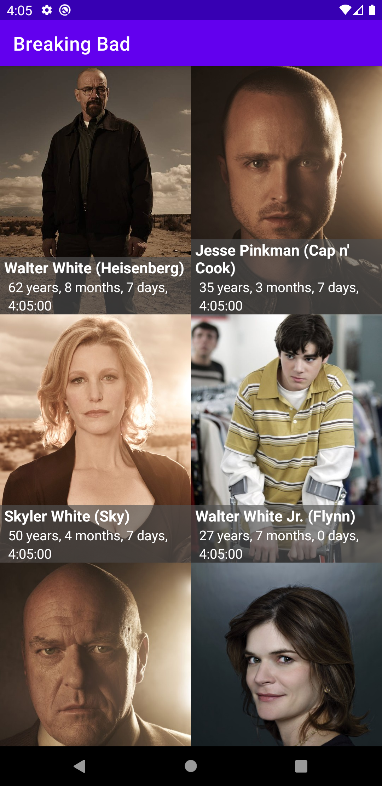

# BreakingBad

Breaking Bad App is an app for Showing characters' live age  

<h2>Features</h2> 

Breaking Bad App gives you the ability to observe on actors' live age

<h2>Prerequisites</h2>

- Compatible with Android SDK 21+.

- Make sure to enable `Unknown Sources` option in your settings before downloading the APK outside of Google Play Store.

<h2>Installation</h2>

- [APK](http://bit.ly/3qpspQn)

<h2>Programming Practices Followed</h2>

a) Android Architectural Components
b) MVVM Architecture and Repository pattern
c) Dagger Hilt
d) coroutines
e) Retrofit and OKhttp
f) Espresso for ui testing
g) Mockk and Junit for unit testing
i) Using RecyclerView ListAdapter
j) using Modularization

<h2>Contributing</h2>

Pull requests and stars are always welcome. For bugs and feature requests, [please create an issue](../../issues/new).

<h2>License</h2>

Copyright 2021 BreakingBad App

Licensed under the [MIT License](LICENSE.md)
